<!-- BANNER: anillo Hytrex animado + nombre. Estático, lo genera scripts/marca.mjs -->
<div align="center">

<a href="https://hytrex.co">
  
</a>

<br/><br/>



<br/><br/>

<!-- TYPING SVG -->
<a href="https://git.io/typing-svg">
  
</a>

<br/><br/>

<a href="mailto:juan.bonilla3@estudiantesunibague.edu.co">
  
</a>
&nbsp;
<a href="https://github.com/JuanBonilla1305">
  
</a>

<br/><br/>

<!-- BADGES DE VISITAS Y ESTADO -->

&nbsp;

&nbsp;


<br/><br/>

<!-- CONTADORES VIVOS: los reescribe el workflow, no los toques a mano -->
<!-- resumen:inicio -->

&nbsp;

<!-- resumen:fin -->

<br/><br/>


</div>

<br>

## ⚡ `whoami`

```javascript
const juan = {
  nombre:     "Juan Bonilla",
  rol:        ["Estudiante de Ing. Sistemas", "Game Developer", "Backend Dev"],
  universidad: "Universidad de Ibagué 🎓",
  pasiones:   ["Videojuegos", "Arquitectura de Software", "Sistemas Distribuidos"],
  actualmente: "Construyendo Surtimotos y DevUP 🚀",
  meta:        "Crear software que deje huella",
};
```

> *Combino la creatividad del **desarrollo de videojuegos** con la rigurosidad técnica de la **arquitectura de software** y los sistemas distribuidos.*

<div align="center">

</div>

## 🛠️ Tecnologías y Herramientas

<div align="center">

<!-- Lenguajes -->
**[ LENGUAJES ]**


<!-- Game Dev -->

**[ GAME DEV & DISEÑO ]**


&nbsp;


<!-- Web & Backend -->

**[ WEB & BACKEND ]**


<!-- Datos & Cloud -->

**[ DATOS & CLOUD ]**


<!-- Herramientas -->

**[ HERRAMIENTAS ]**


</div>

<div align="center">

</div>

## 🚀 Proyectos

<div align="center">

<!-- Las fichas las genera el workflow desde proyectos.json. Para añadir un -->
<!-- proyecto, edita ESE archivo: lo que escribas aquí dentro se sobreescribe. -->
<!-- proyectos:inicio -->
### 🎮 Game Dev

| Proyecto | Descripción | Stack | 90 días |
|:--|:--|:--:|:--:|
| **[Operación Pijao](https://github.com/JuanBonilla1305/web-operacion-pijao)**<br><sub>[GDD](https://github.com/JuanBonilla1305/gdd-operacion-pijao)</sub> | Plataformas 2D side-scrolling ambientado en Ibagué: combate, jefes y sprites propios. | `Unity` `C#` `Aseprite` | 0<br><sub>hace 4 meses</sub> |

### 🏗️ Productos y clientes

| Proyecto | Descripción | Stack | 90 días |
|:--|:--|:--:|:--:|
| **[Surtimotos](https://github.com/JuanBonilla1305/SurtImotos)** | Catálogo e inventario para una compraventa de motos: panel de trámites y vista 360 armada con fotogramas de video real. | `Next.js 16` `TypeScript` `Prisma 7` `PostgreSQL` `Supabase` | 26<br><sub>hace 19 días</sub> |
| **[Lilianno Joyería](https://github.com/JuanBonilla1305/Lilianno_Joyeria)** | E-commerce de joyería con catálogo, carrito persistente, checkout y panel admin con reportes en Excel. | `React 19` `Express` `MongoDB` `JWT` | 0<br><sub>hace 23 días</sub> |
| **Wallnut / Ardys**<br><sub>sin repo público</sub> | Banco virtual estudiantil: cuentas, transacciones seguras y comunicación en tiempo real. | `Node.js` `WebSockets` `MongoDB` | — |
| **msn-matrix**<br><sub>en el portátil</sub> | Matriz MUST / SHOULD / NICE: clasifica una lista de funcionalidades con confianza y justificación. | `Next.js 16` `SDK de Anthropic` | — |

### 🤝 Colaboraciones

| Proyecto | Descripción | Stack | 90 días |
|:--|:--|:--:|:--:|
| **[DevUP](https://github.com/BBMC-S-S-A/DevUP)** | Centro de mando de un equipo: multi-tenencia con aislamiento por fila, canales, llamadas con vídeo y pantalla, tablero de tareas en tiempo real. | `Fastify` `PostgreSQL 17` `WebRTC` `S3` `Docker` | 130<br><sub>hoy</sub> |
| **[domicilios-app](https://github.com/felipebaez07/domicilios-app)** | Domicilios en microservicios (auth, pedidos, tracking, notificaciones); metí mano en el despliegue remoto y la migración a MySQL. | `Node.js` `Microservicios` `MySQL` | 17<br><sub>hace 3 días · ★ 2</sub> |

### 🎓 Universidad

| Proyecto | Descripción | Stack | 90 días |
|:--|:--|:--:|:--:|
| **[Animales-Arquitectura](https://github.com/JuanBonilla1305/Animales-Arquitectura)** | Arquitectura hexagonal llevada a la práctica sobre un dominio simple. | `Node.js` `Hexagonal` | 0<br><sub>hace 5 meses</sub> |
| **[Raffle System](https://github.com/JuanBonilla1305/raffle-system)** | Gestión automatizada de sorteos con lógica de asignación aleatoria. | `JavaScript` `SQL` | 0<br><sub>hace 7 meses</sub> |
| **Lógica de automatización**<br><sub>9 proyectos locales</sub> | DLLs que resuelven la lógica de un robot con cuatro sensores, bandas, un lavadero y el llenado de botellas, para engancharlas a un simulador. | `C++` `Visual Studio` | — |
| **Fundamentos móviles**<br><sub>2 proyectos locales</sub> | Base de Kotlin para móvil: control de flujo, funciones reutilizables y modelado con objetos. | `Kotlin` `IntelliJ` | — |
<!-- proyectos:fin -->

</div>

<div align="center">

</div>

## 📊 GitHub Analytics · Estadísticas

<div align="center">

<!-- Las 4 tarjetas las genera scripts/tarjetas.mjs con datos reales de la API -->
<!-- de GitHub (GraphQL). Ver .github/workflows/tarjetas.yml. -->


<br/><br/>



<br/><br/>



<br/><br/>



</div>

<div align="center">

</div>

## 📈 Actividad por Proyecto

<div align="center">

<!-- Este SVG lo dibuja scripts/grafico.mjs en cada ejecución del workflow. -->


<br/><br/>

**Últimos commits públicos**

<!-- actividad:inicio -->
_Sin actividad pública reciente._
<!-- actividad:fin -->

</div>

<div align="center">

</div>

## 🅗 Hytrex · Mi startup

**Cofundador y CEO.** Hytrex es un estudio de ingeniería digital que cofundé en Colombia.
Transformamos ideas en soluciones tecnológicas de alto impacto: diseñamos, desarrollamos y
escalamos productos digitales que impulsan negocios y mejoran vidas, combinando estrategia,
diseño, ingeniería y automatización. Buena parte de lo que construyo abajo corre sobre los
mismos principios del estudio: **claridad, propósito, impacto**.

<div align="center">

<a href="https://hytrex.co">
  
</a>

</div>

<div align="center">

</div>

## 🎯 Objetivos 2026

<div align="center">

| Meta | Progreso | % |
|:-----|:--------:|:-:|
| 🏗️ Dominar Arquitecturas de Software |  | `50%` |
| 🎮 Publicar primer juego en Steam/Itch.io |  | `40%` |
| ☁️ Certificación AWS |  | `30%` |
| 🌍 Contribuir a Open Source |  | `20%` |

</div>

<div align="center">

</div>

## 🤖 Esta página se actualiza sola

<div align="center">

Los proyectos, las tarjetas de analítica, el gráfico y los últimos commits **no se editan a
mano**.

</div>

La prosa de cada proyecto vive en [`proyectos.json`](proyectos.json). Todo lo que cambia
solo —lenguaje, estrellas, commits de los últimos 90 días, último push, el gráfico y la lista
de commits recientes— lo escribe
[`scripts/actualizar-perfil.mjs`](scripts/actualizar-perfil.mjs) dentro de los bloques
marcados de este README. Las 4 tarjetas de `GitHub Analytics` (calendario, resumen, racha,
lenguajes) las escribe por separado
[`scripts/tarjetas.mjs`](scripts/tarjetas.mjs), con datos de la API GraphQL de GitHub.

El [workflow de proyectos](.github/workflows/actualizar-perfil.yml) corre cada día a las 06:17
UTC y el [workflow de tarjetas](.github/workflows/tarjetas.yml) a las 07:00 UTC, ambos también
a mano desde **Actions** y en cada push que toque su script. Si no hay nada que cambiar, no
hacen commit. Para añadir un proyecto basta con meterlo en `proyectos.json`.

`assets/banner.svg` y `assets/header.svg` son la excepción: son estáticos, los escribe
[`scripts/marca.mjs`](scripts/marca.mjs) a mano (una sola vez, o cuando quiera cambiar el
anillo) y ningún workflow los toca.

<div align="center">

</div>

## 📬 Contacto y Redes

<div align="center">

<a href="mailto:juan.bonilla3@estudiantesunibague.edu.co">
  
</a>
&nbsp;
<a href="https://github.com/JuanBonilla1305">
  
</a>
&nbsp;
<a href="https://www.unibague.edu.co/" target="_blank">
  
</a>

<br/><br/>

<!-- FOOTER WAVE -->


*"El código es poesía, y yo soy un poeta en proceso."*

</div>
